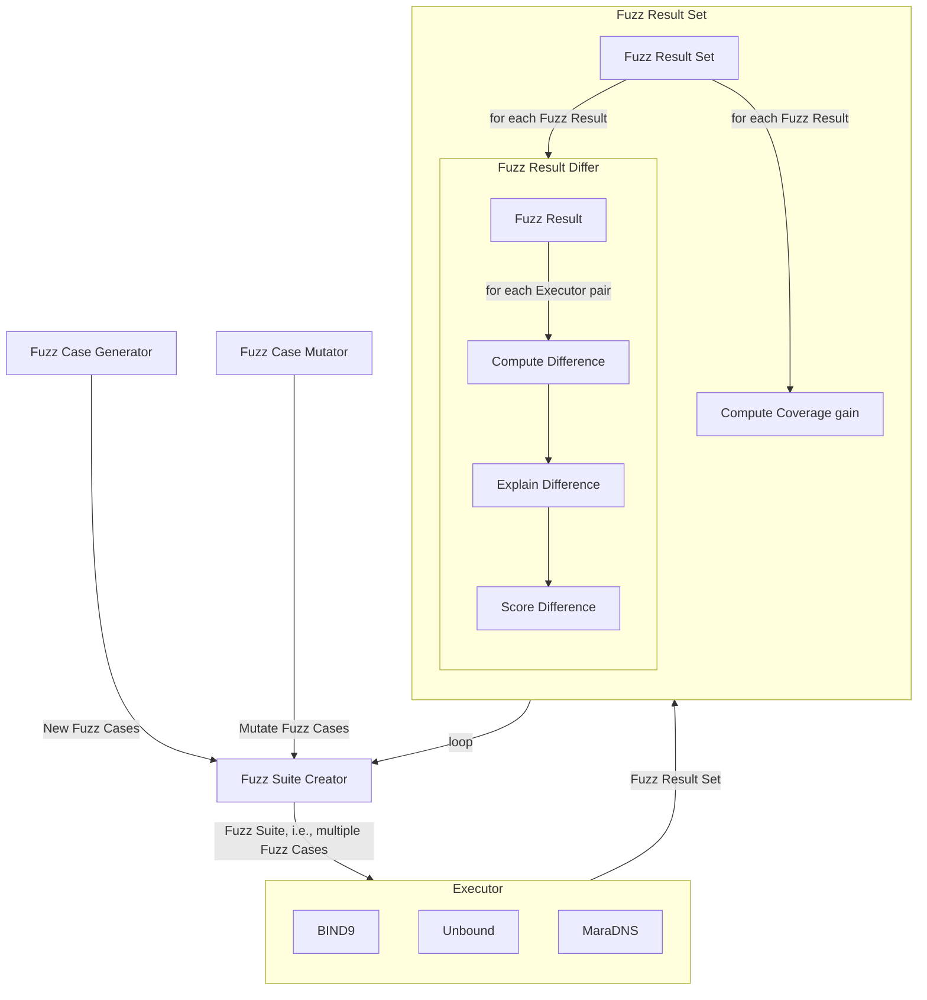

# Fuzzer

```mermaid
flowchart TD
    fcgen[Fuzz Case Generator]
    fcmut[Fuzz Case Mutator]
    fsgen[Fuzz Suite Creator]

    subgraph exec[Executor]
    direction TB

    rbind[BIND9]
    runbound[Unbound]
    rmara[MaraDNS]
    end

    subgraph frproc[Fuzz Result Set]
    direction TB

    subgraph frdiff[Fuzz Result Differ]
    direction TB
    
    fr[Fuzz Result]
    diffcomp[Compute Difference]
    diffexpl[Explain Difference]
    diffscore[Score Difference]

    fr -- for each Executor pair -->  diffcomp --> diffexpl --> diffscore
    end

    frs[Fuzz Result Set]
    cov[Compute Coverage gain]

    frs -- for each Fuzz Result --> cov & frdiff
    end

    fcgen -- New Fuzz Cases --> fsgen
    fcmut -- Mutate Fuzz Cases --> fsgen
    fsgen -- Fuzz Suite, i.e., multiple Fuzz Cases --> exec
    exec -- Fuzz Result Set --> frproc
    frproc -- loop --> fsgen

    %% State[(State)]
    %% Diffscore -. Rank Fuzz Result .-> state
    %% State -. ranks base Fuzz Cases .-> fcmut
    %% State -. access current coverage .-> cov
    %% Cov -. Rank Fuzz Result .-> state
```
